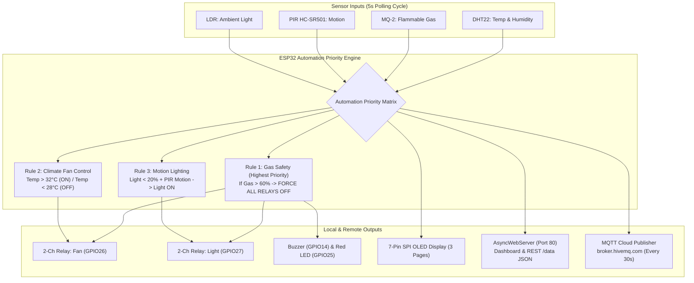

# 🎓 IIT Jammu Summer School 2026 — IoT & Drones Home Assignments Submission

<div align="center">

[](#)
[](https://github.com/Vraj-Ramavat)
[](#)
[](#)
[](#)

### ⚡ Complete Multi-Sensor Embedded Systems, Web Dashboards & Capstone Home Automation Hub ⚡

[Explore Projects](#-projects-index) • [Capstone Hub](#-capstone-full-iot-home-automation-hub-p10) • [Hardware Setup](#-technical-innovations--engineering-highlights) • [Submission Compliance](#-submission-guidelines-compliance-checklist)

</div>

---

## 📌 Submission Overview

This repository contains the official home assignment submissions for the **IIT Jammu Summer School 2026 (IoT & Drones Program)** developed by **Vraj Ramavat**. 

Out of the 10 coursework assignments, **8 comprehensive core and capstone projects** (P1, P2, P3, P4, P6, P8, P9, and the advanced P10 Capstone Hub) have been engineered, optimized, hardware-adapted, fully documented, and submitted with complete demonstration videos.

> [!NOTE]
> **Coursework Focus**: Projects 5 (Bluetooth Light Controller) and 7 (Motion Security Camera) were intentionally omitted to concentrate engineering effort on building, debugging, and perfecting the remaining 8 complex multi-sensor, web-connected, and capstone automation modules.

---

## 📂 Projects Index

| # | Project Name | Microcontroller | Key Hardware & Sensors | Primary Logic & Features | Demo Video |
| :--- | :--- | :--- | :--- | :--- | :--- |
| **P1** | Smart Room Climate Monitor | ESP32 | DHT22, 7-pin SPI OLED, Active Buzzer, Red/Green LEDs | CSV Serial logging, Max/Min daily tracker, High-temp alert (>38°C) | [🎬 Watch Demo](https://drive.google.com/drive/folders/11xXk5HcE5a5OeeX7RsooTPi0qlOb1i7U?usp=sharing) |
| **P2** | Gas & Fire Safety Alert System | Arduino Uno | MQ-2 Gas, Active-Low Flame Sensor, Buzzer, Mute Btn | Gas (>30%) & Fire alarms, 30s non-blocking audio mute override | [🎬 Watch Demo](https://drive.google.com/file/d/1aXetJgAu9GgYf4GEAz94JnL8eWgjovdT/view?usp=sharing) |
| **P3** | Ultrasonic Parking Assistant | Arduino Uno | HC-SR04 Ultrasonic, SPI OLED, Active PWM Buzzer, Tri-LEDs | 5-sample acoustic filtering, 4 proximity zones with dynamic beep frequency | [🎬 Watch Demo](https://drive.google.com/file/d/1i5nrpRfMtIrRix0Z7caPhr_TxXc5F2cz/view?usp=sharing) |
| **P4** | Smart Plant Watering Monitor | ESP32 | Capacitive Soil Moisture, DHT22, 2-Ch Relay, SPI OLED, Button | Hysteresis pump control (ON <30%, OFF >40%), calibrated raw moisture scale | [🎬 Watch Demo](https://drive.google.com/file/d/1lmV34iSDWoWjnpJLRm2e--SWh8PrlMBD/view?usp=sharing) |
| **P6** | Wi-Fi Weather Dashboard | ESP32 | DHT22, BMP280 (I2C), LDR, SPI OLED, AsyncWebServer | Hosted HTML weather dashboard, `/data` REST JSON endpoint, auto Wi-Fi reconnect | [🎬 Watch Demo](https://drive.google.com/file/d/1T4ZiVwI6QMQdbbKgNOEkscs-3Sj8QnoZ/view?usp=sharing) |
| **P8** | IoT Pressure & Altitude Logger | ESP32 | BMP280 (I2C), Potentiometer, SPI OLED, Red/Green LEDs | 24-point circular pressure logging, rising/falling weather predictions | [🎬 Watch Demo](https://drive.google.com/file/d/1mDGfASfnVX1Ro6ogJCD_d_MwIuqGKbg5/view?usp=sharing) |
| **P9** | Stepper Precision Positioner | Arduino Uno | 28BYJ-48 Stepper + ULN2003, 10k Potentiometer, Buttons, SPI OLED | 2048 step resolution (~0.176°/step), real-time pot target tracking, homing routine | [🎬 Watch Demo](https://drive.google.com/file/d/1I_Rf7ZraENPMrwaVtghnoviXfk_Dg3WQ/view?usp=sharing) |
| **P10** | Full Home Automation Hub | ESP32 | DHT22, MQ-2, PIR, LDR, 2-Ch Relay, Active Buzzer, OLED, Web Server | Multi-sensor hub, safety-over-manual priority engine, web controls, HiveMQ MQTT cloud | [🎬 Watch Demo](https://drive.google.com/file/d/1LCE_cEdUZ_KnvtIQAJcFI2XYPHYNZcPI/view?usp=sharing) |

---

## 🏆 Capstone: Full IoT Home Automation Hub (P10)

The Capstone Project (P10) integrates climate monitoring, hazardous gas safety, motion detection, ambient light sensing, automated load switching, responsive web interfaces, and cloud telemetry into a unified embedded system.



### ⚡ Priority Engine Logic
* **Safety Emergency (Highest Priority)**: If MQ-2 gas concentration exceeds 60%, the active buzzer sounds, Red LED turns ON, and both relays force OFF immediately, overriding manual web and physical button toggles.
* **Fan Control**: Automated ON when Temperature > 32°C, OFF when Temperature < 28°C. Manual override allows a 10-minute operation timer.
* **Smart Lighting**: Automated ON when Ambient Light < 20% and Motion is detected by PIR. Automated OFF when Light > 60% or motion is inactive for 3 minutes.

---

## 🔬 Detailed Project Spotlights

### 🌡️ Project 1: Smart Room Climate Monitor (ESP32)
* **Overview**: Monitors ambient indoor climate conditions, cycling between live sensor telemetry and daily maximum/minimum statistics on a 7-pin SPI OLED screen while generating serial CSV logs.
* **Alert Conditions**: Triggers continuous buzzer alert and Red LED when Temperature > 38°C or Humidity > 80%.
* **Daily Tracker**: Stores min/max temperatures recorded since boot using non-blocking `millis()` timing.
* **OLED Mappings**: CLK:18, MOSI:23, CS:5, DC:2, RES:21.

### 🚨 Project 2: Dual-Sensor Gas & Fire Safety System (Arduino Uno)
* **Overview**: Integrated hazard monitoring combining an MQ-2 analog gas sensor and a digital active-low infrared flame phototransistor.
* **Multi-Stage Alarm**:
  * **SAFE**: Green LED ON, Buzzer OFF.
  * **WARNING (Gas 30–60%)**: Yellow LED ON, 1Hz pulsing beep.
  * **DANGER (Gas >60% OR Flame Detected)**: Red LED ON, continuous 2000Hz tone.
* **Silence Button**: Pressing D8 (internal pull-up) mutes the audio buzzer for 30 seconds without disabling visual warning LEDs.

### 🚗 Project 3: Ultrasonic Parking Assistant (Arduino Uno)
* **Overview**: Automotive proximity detection system utilizing an HC-SR04 ultrasonic sensor with a 5-sample acoustic noise filter and dynamic visual/audio feedback.
* **Proximity Zones**:
  * **SAFE (>60cm)**: Green LED, Silent.
  * **CAUTION (30–60cm)**: Yellow LED, 800ms beep interval.
  * **CLOSE (15–30cm)**: Yellow + Red LEDs, 300ms beep interval.
  * **DANGER (<15cm)**: Red LED, continuous alarm tone.
* **OLED Mappings**: CLK:13, MOSI:11, CS:7, DC:8, RES:12.

### 🌱 Project 4: Smart Plant Watering Monitor (ESP32)
* **Overview**: Automated irrigation system regulating soil moisture and monitoring ambient temperature with non-chatter relay switching.
* **Hysteresis Relay Control**: Soil Moisture < 30% ---> Relay ON (Pump Active); Soil Moisture > 40% ---> Relay OFF (Pump Idle).
* **Manual Override**: Pressing GPIO0 forces pump active for 5 seconds before returning to automatic tracking.
* **OLED Mappings**: CLK:18, MOSI:23, CS:5, DC:27, RES:14.

### 🌤️ Project 6: Wi-Fi Weather Dashboard (ESP32)
* **Overview**: Internet-connected weather station serving real-time sensor metrics locally on OLED and over HTTP/JSON web interfaces.
* **Web Endpoints**:
  * `http://<ESP32-IP>/` : Web UI with auto-refreshing (10s) card elements and dynamic background colors.
  * `http://<ESP32-IP>/data` : Structured JSON API: `{"temp": 28.5, "humidity": 65.0, "pressure": 1012.3, "altitude": 120.5, "light": 82}`
* **OLED Mappings**: CLK:18, MOSI:23, CS:5, DC:32, RES:33.

### 📈 Project 8: IoT Pressure & Altitude Logger (ESP32)
* **Overview**: Logs atmospheric pressure trends over time, storing 24 hourly readings (simulated as 1-minute intervals for demo).
* **Sea-Level Compensation**: recieves local altitude (0-2000m) from a 10k potentiometer to evaluate sea-level trend accurately.
* **Trend Indicator**: Compares newest vs oldest reading to display RISING, FALLING, or STABLE arrows.
* **OLED Mappings**: CLK:18, MOSI:23, CS:5, DC:32, RES:33.

### ⚙️ Project 9: Stepper Motor Precision Positioner (Arduino Uno)
* **Overview**: Angular position controller operating a 28BYJ-48 stepper motor via ULN2003 driver board with potentiometer target feedback.
* **Controls**: CW step (+45°), CCW step (-45°), Home reset (zero logical origin).
* **OLED Mappings**: CLK:13, MOSI:11, CS:5, DC:6, RES:A1.

---

## ⚙️ Technical Innovations & Engineering Highlights

### 7-Pin SPI OLED Adaptation
The original kit documentation specified a 4-pin I2C OLED display. However, the physical module provided in the hardware kit was a 7-Pin SPI SSD1306 OLED (GND, VCC, D0, D1, RES, DC, CS). All projects (P1, P3, P4, P6, P8, P9, P10) were adapted to utilize hardware SPI constructors (`&SPI`) with optimized pin mappings.

| Signal Line | Function | ESP32 GPIO | Arduino Uno Pin (P3 / P9) |
| :--- | :--- | :--- | :--- |
| **D0** | SPI Clock (SCK) | GPIO18 | D13 |
| **D1** | SPI Data (MOSI) | GPIO23 | D11 |
| **RES** | Hardware Reset | GPIO21 / GPIO14 / GPIO33 / GPIO19 | D12 / A1 |
| **DC** | Data / Command Select | GPIO2 / GPIO27 / GPIO32 / GPIO21 | D8 / D6 |
| **CS** | SPI Chip Select | GPIO5 | D7 / D5 |

### Key Code Optimizations
* **Non-Blocking Execution**: Eliminated blocking `delay()` calls across all sketches in favor of state-machine timing loops powered by `millis()`.
* **Acoustic Noise Filtering**: Implemented a 5-sample moving average filter in P3 (Parking Sensor) to discard spurious ultrasonic echo reflections.
* **Relay Chatter Prevention**: Implemented a 10% hysteresis window (30% to 40%) in P4 (Plant Monitor) to protect relay contact coils from rapid toggling.
* **Buzzer Transition Safety**: Resolved audio hang-ups in P2 and P3 by inserting explicit state transition checks before changing tone output frequencies.
* **Zero-Latency Display Startup**: Updated setup routines in P6, P9, and P10 to sample hardware sensors prior to rendering the initial OLED screen, eliminating blank or zeroed displays on boot.

---

## 🛠️ Hardware & Component Matrix

```text
home-assignment/
├── Microcontrollers
│   ├── ESP32 Dev Module (38-Pin Variant)
│   └── Arduino Uno R3 (ATmega328P)
├── Sensors & Transducers
│   ├── DHT22 / AM2302 (Temperature & Humidity)
│   ├── BMP280 (I2C Barometric Pressure & Altitude)
│   ├── MQ-2 (LPG / Smoke Flammable Gas Sensor)
│   ├── Infrared Flame Sensor (Digital Active-Low)
│   ├── HC-SR04 (Ultrasonic Rangefinder)
│   ├── PIR HC-SR501 (Pyroelectric Motion Sensor)
│   ├── LDR (Light Dependent Resistor in 10kΩ divider)
│   └── 10kΩ Potentiometers (Analog Target Control)
└── Actuators, Displays & Drivers
    ├── 0.96" 7-Pin SPI OLED Display (SSD1306 128x64)
    ├── 2-Channel Relay Module (Active-LOW 5V Coils)
    ├── 28BYJ-48 Stepper Motor + ULN2003 Driver
    ├── Active Buzzers (PWM & Direct Driven)
    └── Tactile Push Buttons & Tri-color Indicator LEDs
```

---

## 📂 Repository Layout

```text
home-assignment/
├── IIT_Jammu_IoT_Submission_Report.md  # Copy-pasteable Google Doc submission report
├── README.md                           # Comprehensive repository submission index
│
├── home-assignments/
│   ├── p1-climate-monitor/             # P1: ESP32 Smart Room Climate Monitor
│   │   ├── README.md
│   │   └── p1_climate_monitor/
│   │       ├── demo video/             # Google Drive link files
│   │       └── p1_climate_monitor.ino
│   │
│   ├── p2-gas-fire-alert/              # P2: ESP32 Gas & Fire Safety System
│   │   ├── README.md
│   │   └── p2_gas_fire_alert/
│   │       ├── demo video/             # Google Drive link files
│   │       └── p2_gas_fire_alert.ino
│   │
│   ├── p3-parking-sensor/              # P3: Arduino Uno Ultrasonic Parking Assistant
│   │   ├── README.md
│   │   └── p3_parking_sensor/
│   │       ├── demo video/             # Google Drive link files
│   │       └── p3_parking_sensor.ino
│   │
│   ├── p4-plant-monitor/               # P4: ESP32 Smart Plant Watering Monitor
│   │   ├── README.md
│   │   └── p4_plant_monitor/
│   │       ├── demo video/             # Google Drive link files
│   │       └── p4_plant_monitor.ino
│   │
│   ├── p6-wifi-dashboard/              # P6: ESP32 Wi-Fi Weather Dashboard
│   │   ├── README.md
│   │   ├── config.h.example
│   │   └── p6_wifi_dashboard/
│   │       ├── config.h
│   │       └── p6_wifi_dashboard.ino
│   │
│   ├── p8-pressure-logger/             # P8: ESP32 IoT Pressure & Altitude Logger
│   │   ├── README.md
│   │   └── p8_pressure_logger/
│   │       ├── demo video/             # Google Drive link files
│   │       └── p8_pressure_logger.ino
│   │
│   ├── p9-stepper-controller/          # P9: Arduino Uno Stepper Motor Positioner
│   │   ├── README.md
│   │   └── p9_stepper_controller/
│   │       ├── demo video/             # Google Drive link files
│   │       └── p9_stepper_controller.ino
│   │
│   └── p10-home-hub/                   # P10: Full IoT Home Automation Hub (Capstone)
│       ├── README.md
│       ├── config.h.example
│       └── p10_home_hub/
│           ├── config.h
│           └── p10_home_hub.ino
```

---

## 🚀 Getting Started & Execution Guide

### 1. Clone Repository
```bash
git clone https://github.com/Vraj-Ramavat/home-assignment.git
cd home-assignment
```

### 2. Network Credentials Setup (P6 & P10)
For projects requiring Wi-Fi & MQTT connectivity:
1. Navigate to the project directory (e.g., `home-assignments/p10-home-hub/p10_home_hub/`).
2. Copy `config.h.example` to `config.h`.
3. Update `config.h` with your local Wi-Fi SSID, password, and MQTT username:
```cpp
#define WIFI_SSID     "Your_WiFi_SSID"
#define WIFI_PASSWORD "Your_WiFi_Password"
#define MQTT_USERNAME "vrajramavat"
```

### 3. Arduino IDE Setup & Compilation
* **Board Managers**:
  * **ESP32**: Add `https://raw.githubusercontent.com/espressif/arduino-esp32/gh-pages/package_esp32_index.json` to Preferences.
  * **Arduino Uno**: Standard Arduino AVR Boards package.
* **Required Libraries**:
  * `Adafruit SSD1306` & `Adafruit GFX Library`
  * `DHTesp` by beegee-tokyo
  * `Adafruit BMP280 Library` (for P6 & P8)
  * `ESPAsyncWebServer` & `AsyncTCP` (for P6 & P10 on ESP32)
  * `PubSubClient` by Nick O'Leary (for P10 MQTT)
* **Upload**: Select target board and COM port, then click Upload. Open Serial Monitor at 115200 baud.

---

## 📝 Submission Guidelines Compliance Checklist

* [x] **Dedicated Directory Structure**: All projects are isolated within clean subdirectories under `/home-assignments/`.
* [x] **Individual README Documentation**: Every project contains a detailed `README.md` with wiring summary, library versions, state tables, and step-by-step guides.
* [x] **Video Demonstration Links**: All projects include a `demo video/video_link.txt` file referencing the uploaded demonstration recording on Google Drive.
* [x] **Descriptive Commit History**: Git history strictly adheres to standardized commit prefixes (`feat:`, `docs:`, `fix:`) with a minimum of 3 commits per project directory.
* [x] **Sensitive Credential Isolation**: Managed via `config.h` files and tracked in `.gitignore` to prevent credential exposure.

---

## 📜 License
This repository is licensed under the MIT License.

* **Student Author**: Vraj Ramavat
* **Program**: IIT Jammu Summer School 2026 (IoT & Drones Program)
* **Repository**: [Vraj-Ramavat/home-assignment](https://github.com/Vraj-Ramavat/home-assignment)
